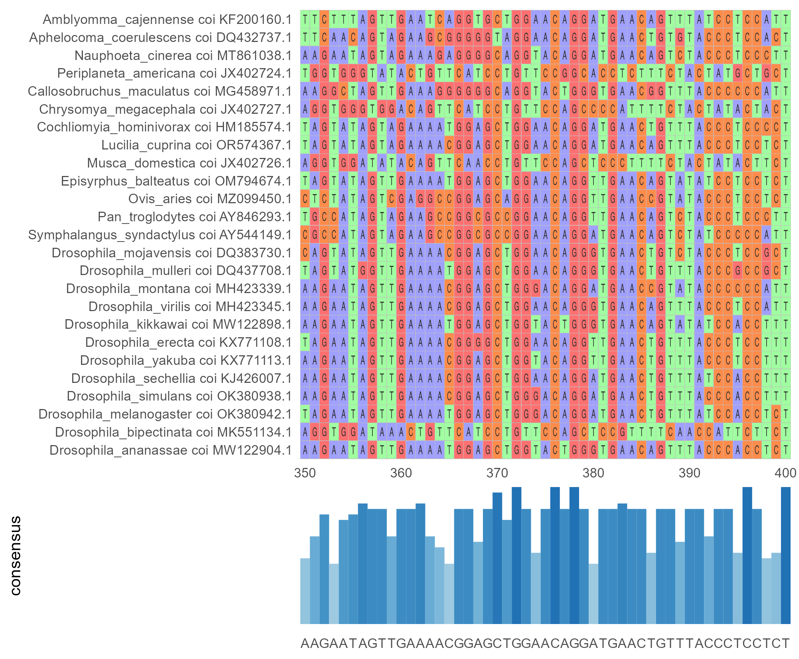

```{r setup, include=FALSE}
knitr::opts_chunk$set(echo = FALSE, message = FALSE, warning = FALSE)
```

## Project Aim

The purpose of this project is to consider the predictors of longevity in organisms across the tree of life. I was particularly interested in whether there is a correlation between the degree of difference in size of heterogametic sex chromosomes and organism lifespan. 

---

## Background Information

##### Heteromorphic Sex Chromosomes

##### Why is there a reduced sex chromosome?

---

## Project Methods

Expanding the code below will show you the packages used in this project. 

```{r packages, echo=TRUE}
# CRAN Packages
library(phangorn)
library(tidyverse)
library(janitor)
library(ape)
library(dplyr)
library(kableExtra)
library(seqinr)
library(reutils)
library(shiny)
library(modelr)
library(MASS)
library(easystats)
library(plotly)

# Bioconductor Packages
library(Biostrings)
library(DECIPHER)
library(ggtree)
library(msa)

# Github Packages
library(ggmsa)
```

### Take a look at the data we have

The table below gives a glimpse into the data that was gathered. The majority of
the data available was longevity data. Where we are constrained in this study is 
in the availability of sex specific genome size data. In my digging through literature, I only found about 25 species that have
sex specific genome size *and* lifespan data.

```{r load_data}
df <- read_csv("analysis_data.csv") %>% 
  janitor::clean_names() %>% 
  mutate_at('ln_r_rlifespan', as.numeric)
```

```{r check_out_data}
head(df) %>% 
  kable() %>% 
  kable_classic(lightable_options="hover") %>% 
  scroll_box(width = "850px")
```

Here, we see a lot of NA's. These are due to the lack of data found for genome sizes. We will sift through this data, first focusing on lifespan differences which we have more information for. Then we will do a tighter filter, exploring the genome size differences.

### Make some initial plots of the data we have

#### <i>Initial Plots: Lifespan</i>

Lets look at all the species we've gathered that have lifespan data for the sexes.

```{r filter_lifespan}
dl <- 
df %>% 
  filter(ln_r_rlifespan != "NA")
```

```{r plot_lifespan, echo=FALSE, fig.height=17, fig.width=8}
dl %>% 
  ggplot(aes(x=ln_r_rlifespan,y=species, color=sex_determination)) +
  geom_point() +
  geom_vline(xintercept = 0) +
  labs(x="Difference in Lifespan", y="Species", title="Difference in Lifespan between Homogametic and Heterogametic Sexes") +
  theme_minimal()+
  theme(axis.text.y = element_text(size=7))
```

The figure above shows the difference between the lifespan of homogametic and heterogametic sexes of certain species. The x-axis plots ln(homogametic lifespan/heterogametic lifespan) to normalize the results. If the point is greater than zero, the homogametic sex lives longer. If it is less than zero, the heterogametic sex lives longer. The colors are based on whether the species' sex determination system is female or male heterogametic.

The following interactive version of this plot allows you to look at the data
based on class, order, and family by changing the colors of the points. 

```{r shiny_app, eval=FALSE, include=FALSE}
categoricalVars <- c("class","order","family","sex_determination")
shinyApp(
  
  # Define UI for application that draws a histogram
  ui <- fluidPage(
  
      # Application title
      titlePanel("Longevity"),
      plotOutput("diffPlot"), # this plot will come from the server
      selectInput(
        inputId = "color_select",
        label = "Select Categorical Variable",
        choices = categoricalVars
      )
      
  ),
  
  # Define server logic required to draw a histogram
  server <- function(input, output) {
  
      output$diffPlot <- renderPlot({
          # generate bins based on input$bins from ui.R
          ggplot(dl) + 
            aes(x=as.numeric(ln_r_rlifespan),
                y=species,
                color=.data[[input$color_select]]) + 
            geom_point() +
          labs(x="Difference in Lifespan between Sexes") +
          geom_vline(xintercept = 0) +
          theme(
            axis.text.y = element_blank(),
            axis.ticks.y = element_blank()
          )
          # notes about plot: fix vertical spead, remove species with no data
        })
    },
  
  options = list(height = 650)
    
    # Run the application 
    #shinyApp(ui = ui, server = server)

)
```

The following plot is another way of illustrating how much of the difference in lifespan
data resides <i>above</i> zero.

```{r compare_sex}
dl %>% 
  ggplot(aes(x=sex_determination,y=ln_r_rlifespan, fill=sex_determination)) +
  geom_violin() +
  theme_minimal()
```

From our lifespan plots, we can see that the homogametic sex lives longer. However, this is not new information. We want to see if the difference in the size of the sex chromosomes contributes to the degree of difference in longevity. To do that we have to narrow our data again to the observations where genome size data was found.

#### <i>Initial Plots: Genome Size</i>

Let's now look at all the species who have both lifespan and genome size data. This is the smaller dataset of 25 species. 

```{r filter_genome_size}
dg <- 
  dl %>% 
  filter(gs_diff_mb != "NA")
dg$gs_diff_mb <- ifelse(dg$sex_determination == "female heterogametic", -dg$gs_diff_mb, dg$gs_diff_mb)
```

```{r plot_genome_size}
p <- dg %>% 
  ggplot(aes(x=gs_diff_mb, y=ln_r_rlifespan, color=sex_determination)) +
  geom_smooth(method="lm",se=FALSE, color='gray', linetype=2, size=0.5) +
  geom_point() +
  labs(x="Difference in Genome Size", y="Difference in Lifespan") +
  theme_minimal()
ggplotly(p)
```

This plot reveals that most of the data we have is male heterogametic. There is only one female heterogametic data point. Also, the outliers make it appear as though there is a trend, but really it is hard to believe that there is actually a positive trend worth noting. From this plot, we can not conclude a correlation between the difference in size of the heterogametic sex chromosomes and the difference in lifespan between the sexes. 

Lets quickly restrict the data to a subset of -250:250 Mb to see how the trendline behaves. 

```{r plot_subset_genome_size}
# ignoring the points that reside outside of 100Mb difference on each side.
p <- dg[dg$gs_diff_mb < 250 & dg$gs_diff_mb > -250,] %>% 
  ggplot(aes(x=gs_diff_mb, y=ln_r_rlifespan, color=sex_determination)) +
  geom_smooth(method="lm", se=FALSE , color='gray', linetype=2, size=0.5) +
  geom_point() +
  labs(x="Difference in Genome Size", y="Difference in Lifespan") +
  theme_minimal()
ggplotly(p)
```

As expected, when the more extreme values are removed. the trendline starts to flatten out. There does not seem to be a significant relationship between difference in size of the sex chromosomes and longevity.

I want to collect more data on the longevity and differences in genome size of species so that I can further investigate a pattern. Until then, let's look at the linear model of the data and see what predictions would be made if the data followed the model.

### View predictions

##### Model for the smaller subset of Genome Size data

The only predictor being explored for this data set is the difference in genome size data. This makes a simple linear model that predicts along the equation y = 0.1276 + 0.0004x.  Only 0.55% of the variance is explained by the predictor. Here are the predictions of difference in lifespan data based off the real data.

```{r}
dg1 <- dg[dg$gs_diff_mb < 250 & dg$gs_diff_mb > -250,]
lm_mod2 <- lm(ln_r_rlifespan ~ gs_diff_mb, dg1)
dg1 %>%
  gather_predictions(lm_mod2) %>% 
  ggplot(aes(x=gs_diff_mb, y=pred, color=sex_determination)) +
  geom_point() +
  labs(x="Difference in Genome Size", y="Difference in Lifespan Prediction") +
  theme_minimal()
```

This model informs us that the p-value is 0.742. There is no significant relationship between the difference in lifespan and the difference in genome size shown by our sample.

### Build a phylogeny

Though I still have the goal of collecting more data, I wanted to learn a method
for creating a phylogenetic tree so that I could implement it in further analyses.

#### <i> Get accession numbers </i>

Dr. Carl Hjelman at Utah Valley University worked with me on this piece of code. It's 
purpose is to take a list of species and genes from the user and create a data frame 
of their accession numbers from GenBank. The lengths of the genes found are included
in the table to help identify suspicious results. 

```{r get_accession, eval=FALSE, echo=TRUE}
#### Retrieving Accession Numbers from Genbank ####
#### function that takes a term and finds genbank data for it ####
grab.results <- function (term) {
  # Search for the given term on nuccore. This gives us a list of
  # record IDs.
  ids <- esearch(term, db="nuccore")
  # Grab summaries for the given record IDs, as a sort-of data frame.
  sum <- esummary(ids, db="nuccore")
  data <- content(sum, as="parsed")
  # For some reason, this parser gives us lists of lists instead of a
  # proper data frame (which should be lists of vectors). Return a
  # fixed-up version.
  data.frame(lapply(data, as.character), stringsAsFactors=FALSE)
}

# read in my data and only use the data that I have both lifespan and genome size data for
spec<-read.csv("lifespan_species.csv")
# put in list of genes to collect accessions for
gene.list<-c("mitochondrion","coi","coii", "coiii", "cytb", "hunchback")
# make matrix to be populated
accession_out<-matrix(,nrow=length(spec$names),ncol=(length(gene.list)*2+1))
# make list of column names for table
columns <- list()
columns <- append(columns, "Spec")
for(i in 1:length(gene.list)){
  columns <- append(columns, paste(gene.list[i],"Acc"))
  columns <- append(columns, "Len")
}
colnames(accession_out) <- columns

#loop to add data to table
for(i in 1:length(spec$names)){
  accession_out[i,1] <- spec$names[i]
  for(k in 1:6){
    testing<-(grab.results(term=(paste(spec$names[i],gene.list[k]))))
    if(length(testing)<1){
      (k<-(k+1))}
    #the below lets us know if after we filter to only DNA and remove other species that we still have data
    #this lets us filter out RNA and also organisms that don't match but might appear
    #like parasites, worms, etc.
    else if(length((subset(testing, testing$MolType == "dna" & testing$Organism == spec$names[i] & as.numeric(testing$Slen)<21000))[1])
            <1){
      k<-(k+1)
    }
    #this pulls data if we have data, DNA, and the right species, and filters out things larger than mitochondria
    else{
      testagain<-(subset(testing, testing$MolType == "dna" & testing$Organism == spec$names[i] & as.numeric(testing$Slen)<21000))
      accession_out[i,(k*2)]<-testagain$AccessionVersion[1]
      accession_out[i,(k*2+1)]<-testagain$Slen[1]}
  }
}

write.csv(accession_out,"accession/accession_numbers.csv", row.names = FALSE)
```

```{r display_accessions}
df <- read_csv("accession/accession_numbers.csv")
df[,1:8] %>% 
  kable() %>% 
  kable_classic(lightable_options="hover")
```

We surprisingly got pretty complete coi data! The lengths reveal some issues where 
the sequence pulled from GenBank probably wasn't the best option. I manually checked
on those that were further away from 600 bp to see if they have more comparable options on GenBank. The coi gene will be what I construct the tree off of.

#### <i> Make multi fasta </i>

The next code chunk converts the accession data
into a multi fasta with simple descriptor lines. 

```{r multi_fasta, eval=FALSE, echo=TRUE}
# read in your file of accession numbers to feed into script
df <- read_csv("accession/accession_numbers_fixed.csv") %>% 
  clean_names()

gene_accession_numbers <- df$coi_acc

# Fetching the sequences from GenBank
gene_sequences <- read.GenBank(gene_accession_numbers)
# creates a list of DNAbins

#accession number corresponding to species names/gene
gene_sequences_GenBank_IDs <- paste(attr(gene_sequences, "species"), names(gene_sequences), sep=" coi ")
#, nbcol = 6, colsep = " ", colw = 10 -> possible addition but I do not think it is needed. 

# Write the sequences to a FASTA file 
write.dna(gene_sequences, file = "accession/coi.fasta", format = "fasta", append = FALSE)

# Read the sequences from the FASTA file
gene_seq_format <- read.FASTA(file = "accession/coi.fasta")

# Modify the names of the sequences
names(gene_seq_format) <- gene_sequences_GenBank_IDs

# Write sequences to a new FASTA file 
write.FASTA(gene_seq_format, file = "accession/coi_seq_format.fasta")

# this output a nice multi fasta, I just don't know for sure if I have all the species I'm aiming for
```

My future goals for making multi fastas is to create a super matrix that consists of multiple genes for all the species so that I can build larger trees. 

#### <i> Conduct an alignment </i>

Next, I wanted to learn how to do an alignment and a simple tree. Here is a section of the alignment I performed in R. The is lots of variation since I am using species that are not closely related.



#### <i> Build Trees </i>

With DECIPHER and Phangorn, I was able to make a tree with neighbor joining.
I do not believe this tree is very accurate.

```{r easy_alignment, eval=FALSE, echo=TRUE}
gimme_fast <- readDNAStringSet("accession/coi_seq_format.fasta") # read in multi fasta as a string set
alignment <- AlignSeqs(gimme_fast) # perform profile-to-profile alignment
distance <- dist.dna(as.DNAbin(alignment)) # find pairwise distances
tree <- njs(distance) # have to use this because there is studd missing from the distance matrix
ape::write.tree(tree, file='tree/tree.txt') # write tree out in newick format
```

```{r display_easy_tree, fig.width=10}
tree <- read.tree("tree/tree.txt")
options(ignore.negative.edge=TRUE) # i did this to stop the tree going back on itself
ggtree(tree, layout = "rectangular") +
  geom_tiplab(align=TRUE, linesize=.5) + ggplot2::xlim(0, 2)
```

This tree shows weird groupings that I do not trust. I have a lot of drosophila data, but it is weird that it is popping up in random areas. 

Using software outside of R (MAFFT & BEAST), I performed an alignment and made a tree with the sequences. While using MAFFT online, I saw that some of my sequences could have been reversed which could explain some of the weird relationships seen with the neighbor joined tree. The relationships shown in the BEAST tree follow expectations more closely.


Let's look at the phylogeny along side the data.
Here are visualizations of the BEAST tree that show the data in continuous scale gradient.


This final plot shows all the data that I was focusing on side by side. While there still doesn't seem to be a correlation between the data, this visualization helps us to ask more questions. Do organisms with smaller genomes tend to have smaller differences in sex chromosome size? Is this affecting the trends that we are seeing?

```{r shorter_easy_tree, eval=FALSE, include=FALSE}
tree2 <- drop.tip(tree, tip = 12) # removes pan troglodytes because we know that one is weird and wrong
tree2 <- drop.tip(tree2, tip = 11) # removes ovis aries because it is so big we can't see anything else
tree2 <- drop.tip(tree2, tip = 1)
ape::write.tree(tree2, file='tree/tree2.txt')
```

```{r shorter_easy_tree_fig, eval=FALSE, fig.width=8, include=FALSE}
tree2 <- read.tree("tree/tree2.txt") # load the tree file in
tree2$edge.length <- rep(1, Nedge(tree2))

p <- ggtree(tree2)

# add in the data you want
# currently this plot shows 22 of the 25 observations in a neighbor based phylogeny 
df <- read_csv("short_complete_data.csv") %>% 
  filter(species != c("Ovis aries","Pan troglodytes")) %>% 
  filter(species != "Amblyomma cajennense")

d1 <- data.frame(id=tree2$tip.label,
                 life=df$ln_r_rlifespan,
                 gs_diff=df$gs_diff_mb,
                 sex=df$sex_determination)

p2 <- facet_plot(p, panel="Difference in Lifespan",
                 data=d1,
                 geom=geom_point,
                 mapping=aes(x=life, color=sex))

p3 <- facet_plot(p2, panel="Difference in Genome Size",
                 data=d1,
                 geom=geom_segment, 
                 aes(x=0, xend=gs_diff, y=y, yend=y, color=sex), size=5)

p3 + theme_tree2() + geom_vline(xintercept = 0, alpha=0.5, linetype = "dashed")
```


### Future Steps

I want to collect more data to see if the lack of correlation is due to a small sample size. I also want to create more robust and accurate trees to perform phylogenetically independent contrasts that will help me to see if phylogentic relationships affect the data. 

